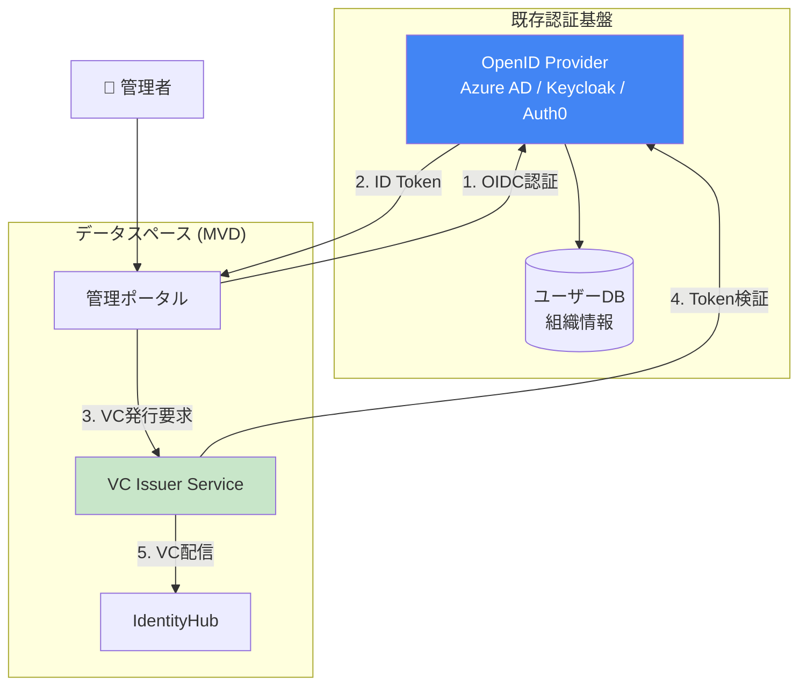
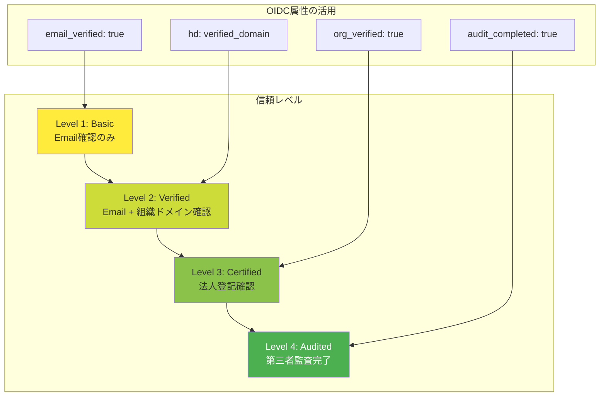
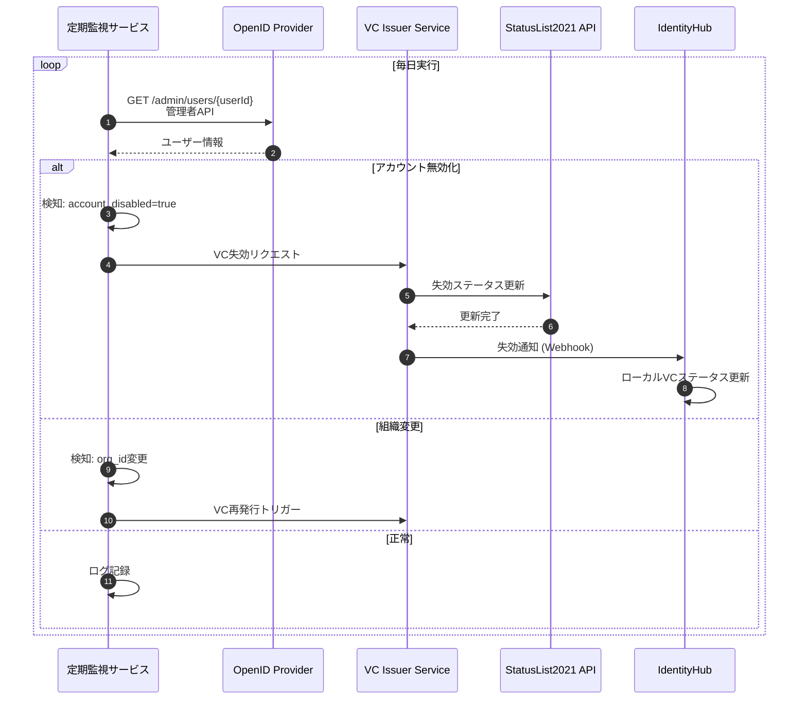
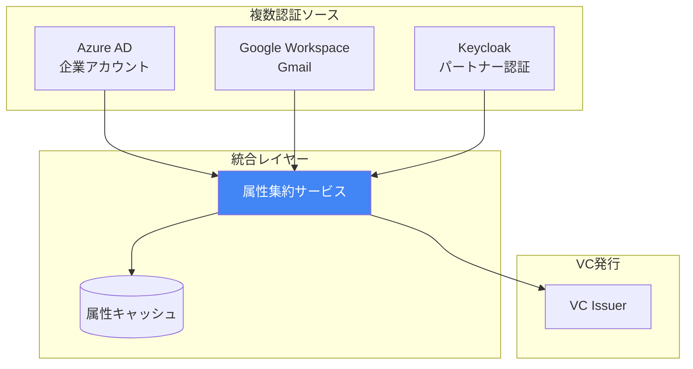

# OpenID Connect統合による実在性確認

## 概要

既存のOpenID Connect (OIDC) インフラストラクチャを活用して、W3C Verifiable Credentialsの発行時に組織や個人の実在性を確認する方法を説明します。

---

## パターン1: OIDC認証後のVC発行

### ユースケース
企業がデータスペースに参加登録する際、既存の企業向けOIDCプロバイダー（Azure AD、Google Workspace、Keycloak等）で認証し、その結果を元にMembershipCredentialを発行する。

### アーキテクチャ図



### 実装例 (Java)

```java
@RestController
@RequestMapping("/api/onboarding")
public class OnboardingController {
    
    @Inject
    private OAuth2TokenValidator tokenValidator;
    
    @Inject
    private CredentialIssuerService issuerService;
    
    /**
     * OIDC認証を経て組織のVCを発行
     */
    @PostMapping("/register-organization")
    public ResponseEntity<CredentialIssuanceResponse> registerOrganization(
            @RequestHeader("Authorization") String bearerToken,
            @RequestBody OrganizationRegistrationRequest request) {
        
        // 1. OIDCトークンを検証
        var validationResult = tokenValidator.validate(bearerToken);
        if (validationResult.failed()) {
            return ResponseEntity.status(401).build();
        }
        
        // 2. トークンからユーザー情報を抽出
        var userInfo = validationResult.getContent();
        var email = userInfo.getClaim("email");
        var emailVerified = userInfo.getClaim("email_verified");
        var organizationId = userInfo.getClaim("org_id"); // カスタムクレーム
        var domain = extractDomain(email);
        
        // 3. 実在性確認
        if (!emailVerified) {
            return ResponseEntity.status(403)
                .body(new ErrorResponse("Email not verified"));
        }
        
        // オプション: 外部APIで法人登記確認
        var legalVerification = verifyLegalEntity(organizationId, domain);
        
        // 4. VC生成
        var credential = VerifiableCredential.Builder.newInstance()
            .type("VerifiableCredential", "MembershipCredential")
            .issuer("did:web:dataspace-issuer")
            .credentialSubject(CredentialSubject.Builder.newInstance()
                .id(request.getDid())
                .claim("organizationId", organizationId)
                .claim("legalName", request.getLegalName())
                .claim("domain", domain)
                .claim("emailVerified", true)
                .claim("verifiedBy", "oidc:" + userInfo.getIssuer())
                .claim("verifiedAt", Instant.now().toString())
                .claim("legalEntityVerified", legalVerification.isSuccess())
                .build())
            .issuanceDate(Instant.now())
            .expirationDate(Instant.now().plus(365, ChronoUnit.DAYS))
            .build();
        
        // 5. VCに署名
        var signedVc = issuerService.signCredential(credential);
        
        // 6. IdentityHubに配信
        issuerService.deliverToIdentityHub(request.getIdentityHubUrl(), signedVc);
        
        return ResponseEntity.ok(new CredentialIssuanceResponse(signedVc.getId()));
    }
    
    private String extractDomain(String email) {
        return email.substring(email.indexOf('@') + 1);
    }
}
```

### 発行されるVC例

```json
{
  "@context": [
    "https://www.w3.org/2018/credentials/v1",
    "https://w3id.org/mvd/credentials/"
  ],
  "type": ["VerifiableCredential", "MembershipCredential"],
  "issuer": "did:web:dataspace-issuer",
  "issuanceDate": "2025-01-15T10:00:00Z",
  "expirationDate": "2026-01-15T10:00:00Z",
  "credentialSubject": {
    "id": "did:web:acme-corp-identityhub:7093",
    "organizationId": "ORG-12345",
    "legalName": "Acme Corporation Ltd.",
    "domain": "acme-corp.com",
    "emailVerified": true,
    "verifiedBy": "oidc:https://login.microsoftonline.com/tenant-id",
    "verifiedAt": "2025-01-15T10:00:00Z",
    "legalEntityVerified": true,
    "membership": {
      "active": true,
      "memberOf": "Automotive-Dataspace-X",
      "since": "2025-01-15T10:00:00Z"
    }
  },
  "proof": {
    "type": "JwtProof2020",
    "jwt": "eyJhbGciOiJFUzI1NiIsImtpZCI6ImRpZDp3ZWI6ZGF0YXNwYWNlLWlzc3VlciNrZXktMSJ9..."
  }
}
```

---

## パターン2: OIDC属性を利用した段階的信頼

### ユースケース
OpenID Connectで取得した属性（メール検証、組織、役職等）に基づいて、異なるレベルの信頼性を持つVCを発行する。

### 信頼レベルの定義



### 実装例: 信頼レベル評価

```java
public class TrustLevelEvaluator {
    
    public enum TrustLevel {
        BASIC,      // Level 1
        VERIFIED,   // Level 2
        CERTIFIED,  // Level 3
        AUDITED     // Level 4
    }
    
    /**
     * OIDC UserInfoから信頼レベルを判定
     */
    public TrustLevel evaluateTrustLevel(UserInfo userInfo, 
                                          LegalEntityVerificationResult legalCheck,
                                          AuditResult auditResult) {
        
        boolean emailVerified = userInfo.getBooleanClaim("email_verified");
        String hostedDomain = userInfo.getStringClaim("hd"); // Google Workspaceの場合
        boolean orgVerified = legalCheck != null && legalCheck.isSuccess();
        boolean auditCompleted = auditResult != null && auditResult.isPassed();
        
        if (auditCompleted && orgVerified && emailVerified) {
            return TrustLevel.AUDITED;
        } else if (orgVerified && emailVerified) {
            return TrustLevel.CERTIFIED;
        } else if (hostedDomain != null && emailVerified) {
            return TrustLevel.VERIFIED;
        } else if (emailVerified) {
            return TrustLevel.BASIC;
        }
        
        throw new IllegalStateException("Insufficient verification for VC issuance");
    }
    
    /**
     * 信頼レベルに応じたVC生成
     */
    public VerifiableCredential createCredentialWithTrustLevel(
            String did, 
            UserInfo userInfo, 
            TrustLevel trustLevel) {
        
        var subjectBuilder = CredentialSubject.Builder.newInstance()
            .id(did)
            .claim("email", userInfo.getClaim("email"))
            .claim("emailVerified", userInfo.getClaim("email_verified"))
            .claim("trustLevel", trustLevel.name());
        
        // 信頼レベルに応じた追加クレーム
        switch (trustLevel) {
            case AUDITED:
                subjectBuilder
                    .claim("auditedBy", "ISO27001-Auditor")
                    .claim("auditDate", Instant.now().toString())
                    .claim("securityClearance", "HIGH");
                // Fall through
            case CERTIFIED:
                subjectBuilder
                    .claim("legalEntityId", userInfo.getClaim("org_id"))
                    .claim("legalEntityVerified", true)
                    .claim("registrationCountry", "DE");
                // Fall through
            case VERIFIED:
                subjectBuilder
                    .claim("hostedDomain", userInfo.getClaim("hd"))
                    .claim("domainVerified", true);
                // Fall through
            case BASIC:
                // 基本情報は既に追加済み
                break;
        }
        
        return VerifiableCredential.Builder.newInstance()
            .type("VerifiableCredential", "MembershipCredential")
            .credentialSubject(subjectBuilder.build())
            .build();
    }
}
```

### 発行されるVC例 (Level 3: Certified)

```json
{
  "@context": [
    "https://www.w3.org/2018/credentials/v1",
    "https://w3id.org/security/suites/jws-2020/v1"
  ],
  "type": ["VerifiableCredential", "MembershipCredential"],
  "issuer": "did:web:dataspace-issuer",
  "credentialSubject": {
    "id": "did:web:acme-corp:identityhub",
    "email": "admin@acme-corp.com",
    "emailVerified": true,
    "trustLevel": "CERTIFIED",
    "hostedDomain": "acme-corp.com",
    "domainVerified": true,
    "legalEntityId": "DE123456789",
    "legalEntityVerified": true,
    "registrationCountry": "DE"
  }
}
```

---

## パターン3: 継続的な実在性確認 (Continuous Verification)

### ユースケース
VC発行後も、OIDCプロバイダーの情報を使って組織の状態を監視し、問題があればVCを失効させる。

### アーキテクチャ



### 実装例: 監視サービス

```java
@Service
public class ContinuousVerificationService {
    
    @Inject
    private OidcAdminClient oidcClient;
    
    @Inject
    private CredentialRevocationService revocationService;
    
    @Scheduled(cron = "0 0 2 * * *") // 毎日午前2時
    public void verifyActiveCredentials() {
        var activeCredentials = credentialStore.findByStatus(CredentialStatus.ACTIVE);
        
        for (var credentialRecord : activeCredentials) {
            try {
                var oidcUserId = credentialRecord.getMetadata("oidc_user_id");
                var userInfo = oidcClient.getUserInfo(oidcUserId);
                
                // チェック1: アカウント有効性
                if (!userInfo.isAccountEnabled()) {
                    monitor.warning("Account disabled for credential: " + credentialRecord.getId());
                    revocationService.revoke(credentialRecord.getId(), "Account disabled");
                    continue;
                }
                
                // チェック2: Email検証状態
                if (!userInfo.isEmailVerified()) {
                    monitor.warning("Email verification lost for credential: " + credentialRecord.getId());
                    revocationService.revoke(credentialRecord.getId(), "Email verification lost");
                    continue;
                }
                
                // チェック3: 組織変更
                var currentOrgId = userInfo.getOrganizationId();
                var originalOrgId = credentialRecord.getCredentialSubject().getClaim("organizationId");
                if (!currentOrgId.equals(originalOrgId)) {
                    monitor.info("Organization changed for credential: " + credentialRecord.getId());
                    revocationService.revoke(credentialRecord.getId(), "Organization changed");
                    // トリガー: 新組織用のVC再発行プロセス
                    triggerReissuance(credentialRecord, currentOrgId);
                    continue;
                }
                
                monitor.debug("Credential verified: " + credentialRecord.getId());
                
            } catch (Exception e) {
                monitor.severe("Error verifying credential: " + credentialRecord.getId(), e);
            }
        }
    }
}
```

---

## パターン4: 複数OIDCプロバイダーの連携

### ユースケース
企業が複数のOIDCプロバイダー（Azure AD、Google Workspace、独自Keycloak等）を使用している場合、それぞれから属性を集約してVCを発行する。

### 統合フロー



### 実装例: 属性集約

```java
@Service
public class MultiProviderAggregator {
    
    @Inject
    private AzureAdClient azureAdClient;
    
    @Inject
    private GoogleWorkspaceClient googleClient;
    
    @Inject
    private KeycloakClient keycloakClient;
    
    /**
     * 複数プロバイダーから属性を集約
     */
    public AggregatedIdentity aggregateIdentity(String email) {
        var identity = new AggregatedIdentity(email);
        
        // Azure ADから取得
        try {
            var azureUser = azureAdClient.getUserByEmail(email);
            identity.setEmployeeId(azureUser.getEmployeeId());
            identity.setDepartment(azureUser.getDepartment());
            identity.setJobTitle(azureUser.getJobTitle());
            identity.setAzureVerified(true);
        } catch (UserNotFoundException e) {
            // Azure ADにアカウントなし
        }
        
        // Google Workspaceから取得
        try {
            var googleUser = googleClient.getUserByEmail(email);
            identity.setGoogleWorkspaceVerified(true);
            identity.setHostedDomain(googleUser.getHostedDomain());
        } catch (UserNotFoundException e) {
            // Googleアカウントなし
        }
        
        // Keycloak (パートナー認証)から取得
        try {
            var keycloakUser = keycloakClient.getUserByEmail(email);
            identity.setPartnerOrganization(keycloakUser.getOrganization());
            identity.setPartnerVerified(true);
        } catch (UserNotFoundException e) {
            // パートナーアカウントなし
        }
        
        return identity;
    }
    
    /**
     * 集約結果からVC生成
     */
    public VerifiableCredential createEnrichedCredential(
            String did, 
            AggregatedIdentity identity) {
        
        var subjectBuilder = CredentialSubject.Builder.newInstance()
            .id(did)
            .claim("email", identity.getEmail());
        
        // 各プロバイダーからの情報を追加
        if (identity.isAzureVerified()) {
            subjectBuilder
                .claim("azureAd", Map.of(
                    "employeeId", identity.getEmployeeId(),
                    "department", identity.getDepartment(),
                    "jobTitle", identity.getJobTitle(),
                    "verified", true
                ));
        }
        
        if (identity.isGoogleWorkspaceVerified()) {
            subjectBuilder
                .claim("googleWorkspace", Map.of(
                    "hostedDomain", identity.getHostedDomain(),
                    "verified", true
                ));
        }
        
        if (identity.isPartnerVerified()) {
            subjectBuilder
                .claim("partner", Map.of(
                    "organization", identity.getPartnerOrganization(),
                    "verified", true
                ));
        }
        
        // 総合的な信頼スコア算出
        int trustScore = calculateTrustScore(identity);
        subjectBuilder.claim("trustScore", trustScore);
        
        return VerifiableCredential.Builder.newInstance()
            .type("VerifiableCredential", "EnrichedMembershipCredential")
            .credentialSubject(subjectBuilder.build())
            .build();
    }
    
    private int calculateTrustScore(AggregatedIdentity identity) {
        int score = 0;
        if (identity.isAzureVerified()) score += 40;
        if (identity.isGoogleWorkspaceVerified()) score += 30;
        if (identity.isPartnerVerified()) score += 30;
        return score;
    }
}
```

---

## 実装時の考慮事項

### セキュリティ

1. **トークン検証**
   ```java
   // JWTの署名検証、有効期限確認、issuer確認
   var validationResult = jwtValidator.validate(token)
       .withIssuer("https://login.microsoftonline.com/tenant-id")
       .withAudience("my-client-id")
       .execute();
   ```

2. **Scope/Permission確認**
   ```java
   // 必要な権限をチェック
   if (!token.getScopes().contains("profile.read.all")) {
       throw new InsufficientPermissionsException();
   }
   ```

3. **Rate Limiting**
   ```java
   @RateLimiter(name = "oidc-provider", fallbackMethod = "fallback")
   public UserInfo getUserInfo(String userId) {
       return oidcClient.getUserInfo(userId);
   }
   ```

### プライバシー

1. **最小限の情報開示**
   - VCには必要最小限の属性のみ含める
   - 個人識別情報（PII）の取り扱いに注意

2. **選択的開示 (Selective Disclosure)**
   ```json
   {
     "credentialSubject": {
       "emailVerified": true,
       "emailDomain": "acme-corp.com"
       // emailアドレス自体は含めない
     }
   }
   ```

### 相互運用性

1. **標準OIDCクレームの使用**
   ```
   - email
   - email_verified
   - name
   - given_name
   - family_name
   - preferred_username
   - hd (Hosted Domain - Google)
   ```

2. **カスタムクレームの文書化**
   ```yaml
   # Custom OIDC Claims
   org_id: 組織識別子
   org_verified: 組織確認フラグ
   trust_level: 信頼レベル (1-4)
   legal_entity_id: 法人登記番号
   ```

---

## まとめ

### メリット

✅ **既存インフラの活用**
- 新たな認証システム不要
- SSO (Single Sign-On) との統合
- 既存のユーザー管理を利用

✅ **強力な実在性確認**
- Email検証済み確認
- 組織ドメイン確認
- 多要素認証 (MFA) の活用

✅ **運用効率化**
- アカウント無効化時の自動失効
- 組織変更時の自動再発行
- 一元的なユーザー管理

### 注意点

⚠️ **依存関係**
- OIDCプロバイダーの可用性に依存
- プロバイダー側の仕様変更リスク

⚠️ **プライバシー**
- PII (Personally Identifiable Information) の適切な取り扱い
- GDPRなどのコンプライアンス

⚠️ **信頼境界**
- OIDCプロバイダー自体の信頼性評価が必要
- 複数プロバイダー使用時の整合性確保

### 推奨アーキテクチャ

```
[既存認証] → [統合レイヤー] → [VC発行] → [データスペース]
   OIDC        属性集約・検証    Issuer      IdentityHub
```

この構成により、既存のエンタープライズ認証基盤を最大限活用しながら、W3C VC標準に準拠したデータスペースへの参加が可能になります。
